<p align="center">
  
</p>

<h1 align="center">Canadian Soccer Club<span style="font-size: 0.75em;"></span></h1>

<p align="center">
  Backend API and Flutter frontend (Mobile and Web) for Canadian Soccer Club.<br/>
  Developed by <strong>Anthony Liscio</strong><br/>
  <a href="https://github.com/anthony9105">@anthony9105 on GitHub</a>
</p>

<p align="center">
  
  
  
  
  
  <a href="https://apps.apple.com/us/app/canadian-soccer-club/id1564032686" target="_blank">
    
  </a>
  <a href="https://www.canadiansoccerclub.com" target="_blank">
    
  </a>
  
</p>


## Table of Contents
- [Table of Contents](#table-of-contents)
- [Backend (Flask) - Technical Details](#backend-flask---technical-details)
- [Frontend - Flutter (Web, iOS, Android)](#frontend---flutter-web-ios-android)
- [Admin Features](#admin-features)
- [League Section](#league-section)
  - [League Images](#league-images)
- [Pickup Section](#pickup-section)
- [Other Features](#other-features)
- [Home Screen](#home-screen)
- [Login Screen](#login-screen)
- [Contact Us](#contact-us)
- [Forgot Password and Creating New Account](#forgot-password-and-creating-new-account)
- [Gallery](#gallery)
- [Notice](#notice)


## Backend (Flask) - Technical Details
The backend is built with **Python 3.11** using the `Flask` framework, following modern security and development best practices:

<details style="margin-left: 30px;">
<summary>🔐 <strong>Security & Authentication</strong>  <span style="color:gray;font-size:0.75em;">(expand for details)</span></summary>

<div>

  - Environment variables and secrets are securely managed using .env files
  - User passwords are hashed with `bcrypt`, using a unique `SALT` and a `PEPPER`
  - JWT-based authentication using `flask-jwt-extended`:
    - Short-lived **access tokens**  (stored as `HttpOnly` cookies on web)
    - Long-lived **refresh tokens** (also stored as `HttpOnly` cookies on web) so users can 'stay logged-in'
    - CSRF protection via double-submit cookie strategy (for web)
  - Secure cookies with proper flags set (`HttpOnly`, `Secure`, `SameSite=Strict`)
  - Rate limiting via `flask-limiter` backed by `Redis`
  - Google `reCAPTCHA v2` for:
    - Contact Us form, Forgot Password, Change Email, and Create New Account, which all involve being sent emails from users not currently logged in (except for Change Email)
    - This helps prevent spam in areas where a JWT token cannot be used
    - These endpoints are also more strictly rate-limited 
  - HTTPS enforced

</div>
</details>

<div style="margin-top:16px"></div>

<details style="margin-left: 30px;">
<summary>🗄️ <strong>Database & ORM</strong>  <span style="color:gray;font-size:0.75em;">(expand for details)</span></summary>
<div>

  - Relational database
  - Models and queries built using `Flask-SQLAlchemy`
  - Database migrations managed with `Flask-Migrate` (Alembic)
  - Follows a modular and scalable database model structure
</div>
</details>

<div style="margin-top:16px"></div>

<details style="margin-left: 30px;">
<summary>⚙️ <strong>API Architecture</strong> <span style="color:gray;font-size:0.75em;">(expand for details)</span></summary>
<div>

  - Implements the Flask application `factory pattern` for better scalability and testing
  - Modular structure using `Blueprints`:
    - Organized by feature: Auth, Users, League Game, League Season, Pickup Signup, Contact, Gallery, etc.
</div>
</details>

<div style="margin-top:16px"></div>

<details style="margin-left: 30px;">
<summary>🧪 <strong>Testing & CI/CD</strong>  <span style="color:gray;font-size:0.75em;">(expand for details)</span></summary>
<div>

  - Automated testing is done using `pytest`
  - `GitHub Actions` is configured to run the test suite on every commit across:
    - ubuntu-latest
  - The deployment is blocked until all tests pass on all platforms, ensuring platform-independent reliability and stability before production updates
</div>
</details>

<div style="margin-top:16px"></div>

<details style="margin-left: 30px;">
<summary>📧 <strong>Email Handling (via Amazon SES + boto3)</strong>  <span style="color:gray;font-size:0.75em;">(expand for details)</span></summary>
<div>

- All application-related emails are securely sent using `Amazon Simple Email Service (SES)`, with `boto3` AWS SDK, ensuring high deliverability and reliability.
  - Email functionalities include:
    - **✅ Signup, Account Creation, and Existing Account changing their Email**
      - Sends an email with a verification code for users to confirm their email address before account creation/ or when changing their email to a new one.

    - **🔐 Forgot Password / Reset Password**
      - Sends a verification code to the user’s email, which they must enter to reset their password.

    - **📩 Pickup Signup Confirmation**
      - When a user signs up, cancels, or moves off the waitlist for a pickup game, an automatic confirmation email is sent to them.
      - If a spot opens, waitlisted users are automatically emailed to notify them of the available spot.

    - **📨 Contact Us Form**
       - Sends the contents of the form as an email from the application to the site administrator receiving email.
  - All protected by rate limiting and all except the signup confirmation, are protected by Google reCAPTCHA to avoid spam and abuse.
  - Outbound emails are sent from a verified domain and authenticated sender in SES.
  - SPF, DKIM, and DMARC records are configured to enhance email authenticity and prevent spoofing.
</div>
</details>

<div style="margin-top:16px"></div>

<details style="margin-left: 30px;">
<summary>📱 <strong>SMS Notifications (via Amazon SNS + boto3)</strong>  <span style="color:gray;font-size:0.75em;">(expand for details)</span></summary>
<div>

- **Amazon Simple Notification Service (SNS)** is used for sending SMS text messages to users for:
  - 📩 **Pickup Game Signup/Payment Reminders**
  - 📢 **Announcements or Updates**
    - Example: "Canadian Soccer Club e-transfer reminder: Please send your overdue fees to [...].  Thank you"
    - Example: "CANCELLATION.  Canadian Soccer Club session for tonight cancelled due to inclement weather.  More information regarding rescheduling will be communicated at a later time."

- SNS usage (high-level & safe overview):
  - Administrators press a button or perform an action in an admin only section of the app/website
  - The backend triggers an SNS SMS send using `boto3`
</div>
</details>


<div style="margin-top:16px"></div>

<details style="margin-left: 30px;">
<summary>🕓 <strong>Datetime Handling</strong>  <span style="color:gray;font-size:0.75em;">(expand for details)</span></summary>
<div>

  - All datetime fields are stored in the `database in UTC` to avoid ambiguity with Daylight Saving Time (DST) and ensures compatibility across timezones.
  - All datetime fields are converted to `eastern time` when sending data to the `frontend`, and the frontend also sets the datetimes as eastern time (ET).
    - This makes sense due to this app being for local usage

</div>
</details>

<div style="margin-top:16px"></div>

<details style="margin-left: 30px;">
<summary>🔄 <strong>CORS (Cross-Origin Resource Sharing)</strong>  <span style="color:gray;font-size:0.75em;">(expand for details)</span></summary>
<div>

  - Configured via `Flask-CORS` to only allow secure cross-origin requests from:
    - The Flutter Web frontend
    - The mobile app
</div>
</details>

<div style="margin-top:16px"></div>

<details style="margin-left: 30px;">
<summary>☁️ <strong>Image Cloud Storage (Cloudflare R2)</strong>  <span style="color:gray;font-size:0.75em;">(expand for details)</span></summary>
<div>

- All user-uploaded and admin-uploaded images (e.g., profile pictures, gallery, team logos) are stored in `Cloudflare R2`
  - Benefits:
    - Cost-effective
    - S3-compatible object storage
    - Reliable hosting for static media files
</div>
</details>

<div style="margin-top:16px"></div>

<details style="margin-left: 30px;">
<summary>⚡ <strong>Performance & Compression</strong>  <span style="color:gray;font-size:0.75em;">(expand for details)</span></summary>
<div>

  - Gzip compression of all responses using `Flask-Compress` to improve performance for the frontend when receiving data by compressing the size of the data sent to the frontend
  - Static assets (Flutter Web build) served directly from /frontend
</div>
</details>

<div style="margin-top:16px"></div>

<details style="margin-left: 30px;">
<summary>🛡️ <strong>HTTP Security Headers</strong> <span style="color:gray;font-size:0.75em;">(expand for details)</span></summary>
<div>

  - X-XSS-Protection
  - Strict-Transport-Security
  - Content-Security-Policy
  - X-Content-Type-Options
  - X-Frame-Options
  - Referrer-Policy
</div>
</details>

<div style="margin-top:16px"></div>

<details style="margin-left: 30px;">
<summary>🧠 <strong>Code Quality</strong> <span style="color:gray;font-size:0.75em;">(expand for details)</span></summary>
<div>

  - Static type hinting
  - Usage of `mypy` for type checking and better organization
  - Consistent project structure with clearly separated concerns (config, models, controllers, extensions)
</div>
</details>


<br></br>


## Frontend - Flutter (Web, iOS, Android)
- This frontend is built with Flutter and is fully cross-platform, running on:
  - ✅ [Web](https://www.canadiansoccerclub.com)
  - 📱 [iOS](https://apps.apple.com/us/app/canadian-soccer-club/id1564032686)
  - 📱 Android (currently in Closed Testing)
- The app is designed mobile-first but is compatable for web.
- It connects to the Flask backend using HTTP services and securely manages authentication using cookies or tokens depending on platform.

<div style="margin-top:16px"></div>

<details style="margin-left: 25px;">
<summary>🔧 <strong>Project Structure</strong> <span style="color:gray;font-size:0.75em;">(expand for details)</summary>
<div>

  - The codebase follows a modular and clean architecture:

    ```text
    lib/
    ├── models/       # Dart classes representing API data models
    ├── providers/    # State management (Provider)
    ├── screens/      # UI screens/pages, grouped by feature
    ├── services/     # API calls, auth handling, etc.
    ├── utils/        # Reusable helpers (formatting, time, validators)
    ├── widgets/      # Reusable UI components (buttons, appbars, textfields, datepickers, etc.)
    └── main.dart     # App entry point
    ```
</div>
</details>

<div style="margin-top:16px"></div>

<details style="margin-left: 25px;">
<summary>🔒 <strong>Authentication</strong> <span style="color:gray;font-size:0.75em;">(expand for details)</summary>
<div>

  - Web: Auth via secure cookies, with CSRF protection.
  - Mobile (iOS & Android): Auth via JWT tokens, securely stored on device.
  - Shared logic determines login/logout and session refresh behavior based on platform.
</div>
</details>


<br></br>


## Admin Features

<details style="margin-left: 25px;">
<summary>🔄 <strong>Toggle Views</strong> <span style="color:gray;font-size:0.75em;">(expand for details)</span></summary>
<div>

  - Easily switch between `admin mode` and `regular` on various screens
  - Admins see everything users see, but with added admin-only features. 
  - 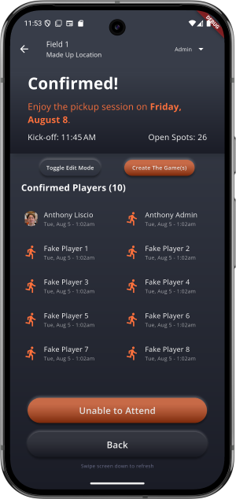
</div>
</details>

<div style="margin-top:16px"></div>


<details style="margin-left: 25px;">
<summary>🔒 <strong>Admin Route Protection</strong> <span style="color:gray;font-size:0.75em;">(expand for details)</span></summary>
<div>

  - Protected by `custom Python decorators` checking the JWT identity in requests
    - Ensuring that there can be no unauthorized use of these sensitive routes 
</div>
</details>

<div style="margin-top:16px"></div>


<details style="margin-left: 25px;">
<summary>👥 <strong>Users</strong> <span style="color:gray;font-size:0.75em;">(expand for details)</span></summary>
<div>

  - Search for user(s) by first and/or last name  
  - View all **active users** (past 3 months)  
  - View all users  
  - View users (all/active) alphabetically by first name  
  - View/edit user information (skill level, positions, early signup status, etc.) 
</div>
</details>

<div style="margin-top:16px"></div>

<details style="margin-left: 25px;">
<summary>🏆 <strong>League</strong> <span style="color:gray;font-size:0.75em;">(expand for details)</span></summary>
<div>

  - Create new leagues  
  - Add/edit teams (name, logo, roster, colour)  
  - Auto-generate the **regular season schedule**  
  - Enter team & player stats for each game  
  - Attach recorded game video(s) from YouTube  
  - Manually add/edit league games (location, date, time), if needed
  - **Download printable game sheets** for a given day (used for the organizer/referree to mark down the goal scorers and attendance for entry into the app later)
</div>
</details>

<div style="margin-top:16px"></div>


<details style="margin-left: 25px;">
<summary>⚽ <strong>Pickup</strong> <span style="color:gray;font-size:0.75em;">(expand for details)</span></summary>
<div>

  - Enable/disable and set pickup session times by field/day of week  
    - (End-of-day auto-generates sessions for the same day next week)  
  - View user signup history for any day, exportable to CSV  
  - Manually add or change user signup status in sessions  
  - View signup times for each user in the Pickup Signup screen 
  - Auto-generate **fair teams** (frontend algorithm)
    - Balances `skill levels`, `primary/secondary positions`  
    - *Update:* Prevents odd cases (e.g., one team with 2 goalkeepers, others with none) 
    - Shows **average skill rating per team**  
    - Admin can still make manual adjustments by swapping players 
    -   
</div>
</details>

<div style="margin-top:16px"></div>


<details style="margin-left: 25px;">
<summary>☁️ <strong>Firebase (mobile-only)</strong> <span style="color:gray;font-size:0.75em;">(expand for details)</span></summary>
<div>

  - **Firebase Messaging**:  
    - Send push notifications to all users (if enabled)  
    - Show in-app messages (e.g., one-time message when opening app)  
  - **Crashlytics**:  
    - Reports errors users encounter, viewable in Firebase Console  
</div>
</details>

<div style="margin-top:16px"></div>


<details style="margin-left: 25px;">
<summary>📰 <strong>Other</strong> <span style="color:gray;font-size:0.75em;">(expand for details)</span></summary>
<div>

  - Create/edit/delete news/announcements
  - Add/delete gallery photos
</div>
</details>


<br></br>


## League Section
- Full league `schedule creation` options for admins
- Manual league game `editing/creation` options for admins
- `Individual player stats` (optional) for each game and for overall league totals:
  - Games played
  - Goals
  - Assists
  - Player of the Matches
  - Wins, losses, draws
  - Yellow cards, red cards
- `Top players for each stat` (example: top 3 in goals for the league) and `ability to sort between all players` for who has the most goals, assists, etc
- `Game events` (optional) for each game:
  - Shows the events of the game during a specific point in the match
  - Example: goal in the first half by Player X assisted by Player Y
- YouTube `videos` for each game (optional):
  - Ability to add the YouTube link of a video recording for the game
  - 2 video link slots (example: 1 for full game, 1 for highlights)
  - Clicking/tapping on the YouTube thumbnail image will redirect to the devices' YouTube app or browser if not available
- `Team stats` and sorted `game history` for the league
  - Games played
  - Wins, losses, draws
  - Points (3 for a win, 1 for draw, 0 for a loss)
  - Goals scored (GF), Goals allowed (GA), Goal difference (GD)
- `Teams`
  - Team logo (optional)
  - Team roster and each players individual stats
  - Game history
- Playoff, current regular season, and historical (week-by-week) `team standings`,

### League Images
<details>
<summary><span style="color:gray;font-size:0.75em;">(expand to see images)</span></summary>
<div>


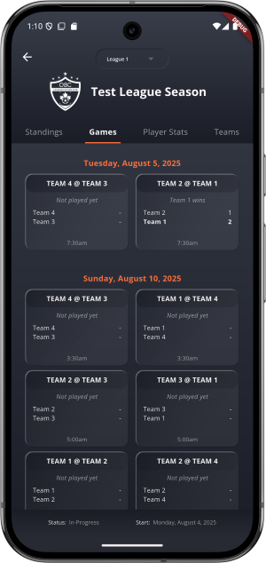
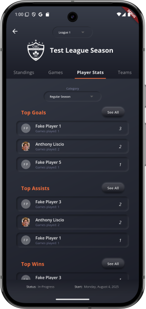
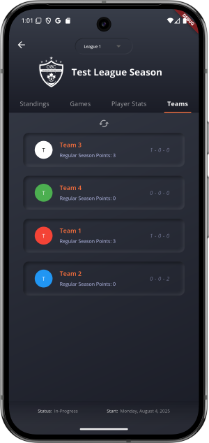
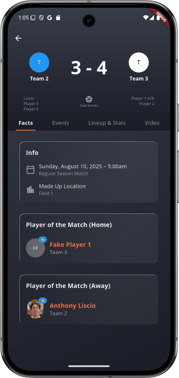


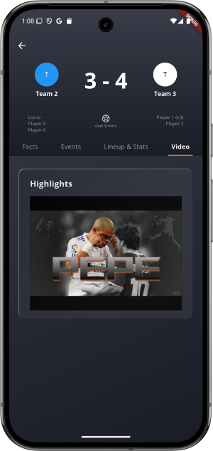
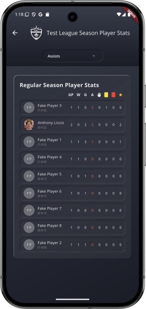
  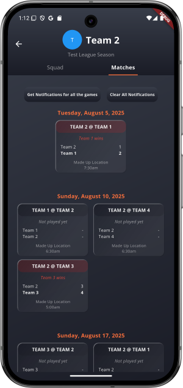
</div>
</details>


<br></br>

## Pickup Section
- Pickup Signups:
  - Contains a time for the actual games
  - Contains time(s) for when users can signup
  - 4 signup statuses:
    - `Confirmed`, `Signed-up` (has a spot but not paid/confirmed yet by admin), `Waitlisted`, `Out` (user changed from one of the other statuses to not available)
  - Each user will only be able to see current or next weeks' days
  - Ability for users to signup, join waitlist, or cancel for these created pickup sessions
    -  This will trigger an `automatic email confirmation` of their action
    -  Will also `email all users on the waitlist if the action causes a spot to open up`
- Auto-creation of Pickup Game Signups done by a scheduled Cron Job/Task based on the `GameTemplate` info:
  - Which field(s):
    - are `enabled`
    - `which day(s)` they are enabled
    - `how many games` there are for the day(s) enabled and at `what time`

    - <details>
      <summary>(expand to see photos)</summary>
      <div>

      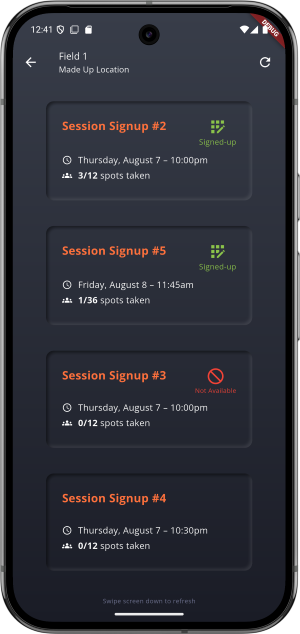
      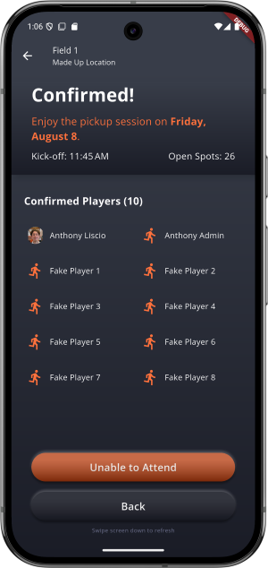
      </div>
      </details>


<br></br>


## Other Features
<details style="margin-left: 25px;">
<summary><strong>User</strong> <span style="color:gray;font-size:0.75em;">(expand for details)</span></summary>
<div>

  - Many screens allow for clicking/tapping of the user's profile picture to:
    - `View players' league stats for all the leagues the have played in`
    - Tap the image again on this screen to have it `zoom to fullscreen view`
    - 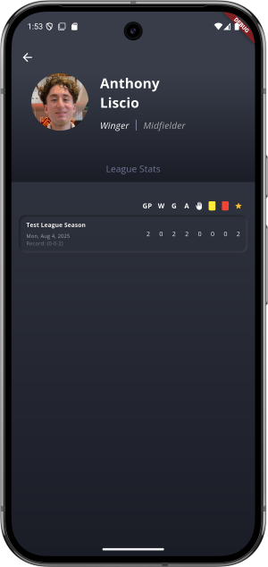
    - 
</div>
</details>


<br></br>


## Home Screen
<details style="margin-left: 25px;">
<summary style="color:gray;">(expand to see images)</summary>
<div>


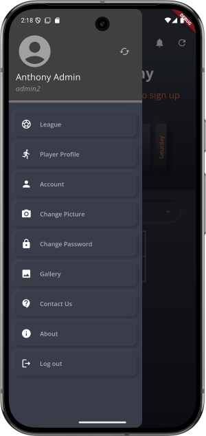
</div>
</details>


<br></br>


## Login Screen
<details style="margin-left: 25px;">
<summary style="color:gray;">(expand to see image)</summary>
<div>


</div>
</details>


<br></br>


## Contact Us
<details style="margin-left: 25px;">
<summary style="color:gray;">(expand to see details)</summary>
<div>

- Contact Us form for anyone to contact the team with a question.  Sends an email from a sender email to a receiver email
- As explained, takes further precautions to prevent spam or abuse
- 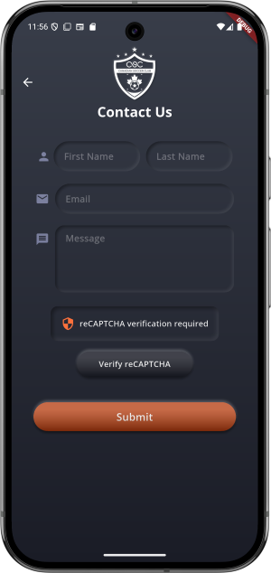
- 
- 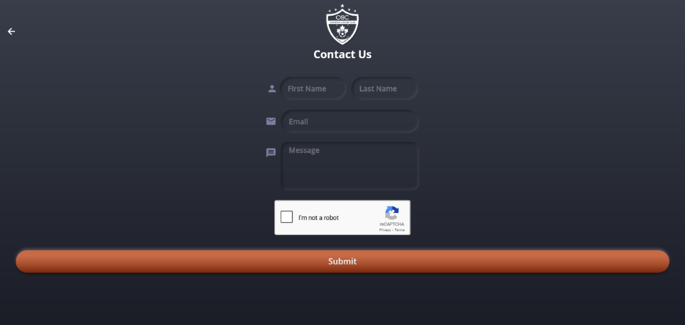
</div>
</details>


<br></br>


## Forgot Password and Creating New Account
- Sends an email containing a verification code that expires after a short time
- As explained, takes further precautions to prevent spam or abuse


<br></br>


## Gallery
- View gallery photos uploaded by an admin
- Can tap/click on the image to view in fullscreen


<br></br>


## Notice
- No payments or sensitive information (payment info, address, etc) is handled in the front or backend.
- Payments for league registration or pickup sessions are made to the owner/organizer totally separate from this app/website


<br></br>